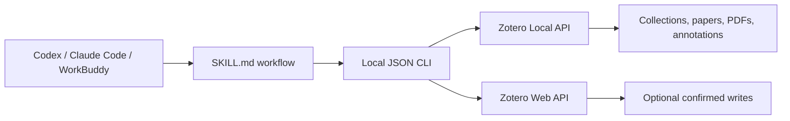

<div align="center">

# Zotero Research Assistant Skill

**Connect AI coding agents to your Zotero library locally — without MCP.**

[简体中文](README.zh-CN.md) · English


</div>

## Overview

Zotero Research Assistant is a portable **Agent Skill** that lets Codex, Claude Code, WorkBuddy, and other terminal-capable agents search and analyze a real Zotero library.

It uses a local Python JSON CLI rather than an MCP server. The agent reads `SKILL.md`, runs deterministic commands, and grounds its answer in returned Zotero data instead of guessing what is in your library.



## Highlights

- Exact collection lookup by key, name, or `parent/child` path
- Recursive collection browsing with deduplication
- Clear errors for missing or ambiguous collection names
- Library-wide or collection-scoped search
- Metadata, attachments, notes, PDF text, and native annotation retrieval
- Repeatable PDF text windows for reading beyond the first few thousand characters
- Standalone PDFs included as documents, while child PDF attachments are deduplicated
- Local, cloud, and hybrid connection modes
- Program-level confirmation gate for note and tag writes
- Machine-readable JSON output for agent-neutral integration
- No MCP server, browser extension, or background daemon required

## Why collection results stay relevant

A collection name is never used as a global keyword query. For a request such as:

> List the papers under the “Human-Computer Interaction” collection.

the Skill follows this route:

1. Resolve “Human-Computer Interaction” to one unique Zotero collection key.
2. Retrieve items directly from that collection.
3. Optionally include subcollections.
4. Return each item's matched collection path.

If the name is missing or ambiguous, the command fails instead of silently returning unrelated papers.

## Requirements

- Python 3.10+
- Zotero 7+ for local API and indexed full-text access
- A terminal-capable agent
- Zotero desktop running for local mode

In Zotero, enable:

`Settings → Advanced → Allow other applications on this computer to communicate with Zotero`

## Quick start

```bash
git clone <your-repository-url>
cd zotero-research-assistant
python -m pip install -r requirements.txt
```

Create the local configuration:

### Windows Command Prompt

```cmd
copy .env.example .env
python scripts\zotero_cli.py health
```

### macOS / Linux

```bash
cp .env.example .env
python scripts/zotero_cli.py health
```

A successful local connection returns:

```json
{
  "ok": true,
  "mode": "local",
  "writeConfigured": false
}
```

## Connection modes

| Mode | Reads | Writes | Required configuration |
| --- | --- | --- | --- |
| Local | Zotero desktop local API | Disabled | `ZOTERO_LOCAL=true` |
| Hybrid | Local API | Zotero Web API | Local mode plus library ID and API key |
| Cloud | Zotero Web API | Zotero Web API | `ZOTERO_LOCAL=false`, library ID, API key |

Minimal local `.env`:

```dotenv
ZOTERO_LOCAL=true
ZOTERO_DATA_DIR=~/Zotero
```

For hybrid or cloud writes, also configure:

```dotenv
ZOTERO_LIBRARY_ID=
ZOTERO_LIBRARY_TYPE=user
ZOTERO_API_KEY=
```

Do not commit `.env` or paste API keys into agent prompts.

## Install into an agent

Run the bundled installer from the project root:

```bash
python scripts/install_skill.py codex
python scripts/install_skill.py claude
python scripts/install_skill.py workbuddy
```

The installer intentionally does not copy `.env`. Copy it separately into the installed Skill directory so updates cannot overwrite local credentials.

| Agent | Personal Skill location | Example invocation |
| --- | --- | --- |
| Codex | `~/.codex/skills/zotero-research-assistant/` | `$zotero-research-assistant list papers in “Human-Computer Interaction”` |
| Claude Code | `~/.claude/skills/zotero-research-assistant/` | `/zotero-research-assistant list papers in “Human-Computer Interaction”` |
| WorkBuddy | Import the folder/ZIP in the Skills UI, or use `~/.workbuddy/skills/` where supported | Ask naturally and select the Skill |

Restart the agent or open a new task if a newly created top-level Skill directory is not detected immediately.

## CLI examples

```bash
# Check connection
python scripts/zotero_cli.py health

# Find the exact collection and see its full path
python scripts/zotero_cli.py find-collection "Human-Computer Interaction"

# Read documents in a collection and all subcollections
python scripts/zotero_cli.py collection-items "Human-Computer Interaction" --recursive --limit 200

# Search the whole library
python scripts/zotero_cli.py search "human AI collaboration" --limit 50

# Search only inside one collection
python scripts/zotero_cli.py search "evaluation" --collection "Human-Computer Interaction" --recursive

# Read metadata, annotations, or a PDF text window
python scripts/zotero_cli.py item ITEMKEY
python scripts/zotero_cli.py annotations ITEMKEY
python scripts/zotero_cli.py read ITEMKEY --start 0 --max-chars 12000
```

All commands write JSON to stdout and return a non-zero exit code when `ok` is false.

## Standalone PDFs

Zotero can store a PDF either under a bibliographic parent item or as a parentless standalone attachment.

- Child PDF attachments are excluded from collection results to avoid counting the same paper twice.
- Parentless PDFs are included with `"standaloneAttachment": true`.
- For richer metadata, right-click a standalone PDF in Zotero and use **Retrieve Metadata for PDF**.

## Safe writes

Notes and tags use a two-step workflow:

1. The agent displays the exact content or tags.
2. The user explicitly confirms in a later message.
3. The agent reruns the command with `--confirm-write`.

Without the flag, the CLI rejects the operation before opening a write client.

```bash
python scripts/zotero_cli.py add-tags ITEMKEY reviewed important --confirm-write
```

Writes require a write-capable Zotero API key, even when reads use local mode.

## Testing

```bash
python -B -m unittest discover -s tests -v
```

The test suite covers exact and ambiguous collection resolution, recursive item retrieval, deduplication, collection-scoped search, standalone PDFs, CLI JSON output, and write confirmation.

## Project structure

```text
zotero-research-assistant/
├── SKILL.md                 # Agent workflow and safety rules
├── README.md                # English documentation
├── README.zh-CN.md          # Simplified Chinese documentation
├── .env.example             # Safe configuration template
├── requirements.txt
├── agents/
│   └── openai.yaml          # Codex-facing Skill metadata
├── references/
│   └── setup.md             # Detailed setup and troubleshooting
├── scripts/
│   ├── zotero_cli.py        # Agent-neutral JSON CLI
│   ├── zotero_tools.py      # Zotero read/write implementation
│   ├── install_skill.py     # Local Skill installer
│   └── deepseek_agent.py    # Optional standalone chat agent
└── tests/
```

## Design references

The project adopts capability ideas from:

- [maciechen/zotero-mcp-workbuddy-guide](https://github.com/maciechen/zotero-mcp-workbuddy-guide)
- [54yyyu/zotero-mcp](https://github.com/54yyyu/zotero-mcp)
- [Pyzotero](https://github.com/urschrei/pyzotero)

This implementation does **not** use MCP; it exposes equivalent core research operations through a local Skill and JSON CLI.

# refresh
