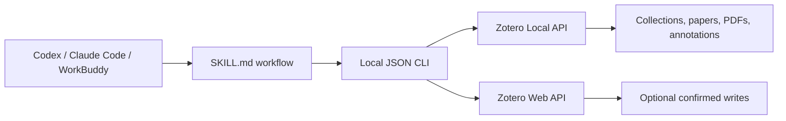

<div align="center">

# 📚 Zotero Research Assistant Skill

**Connect AI coding agents to your Zotero library locally — without MCP.**

[简体中文](README.zh-CN.md) · English


</div>

## 🔎 Overview

Zotero Research Assistant is a portable **Agent Skill** that lets Codex, Claude Code, WorkBuddy, and other terminal-capable agents search and analyze a real Zotero library.

It uses a local Python JSON CLI rather than an MCP server. The agent reads `SKILL.md`, runs deterministic commands, and grounds its answer in returned Zotero data instead of guessing what is in your library.

## 🆕 NEW

- **260811** — Added one-sentence automatic installation: an Agent can download the repository, register the Skill, install dependencies, create a safe local configuration, and verify the connection.
- **260809** — Reworked the project as an Agent-driven Zotero Skill without MCP; strengthened exact collection resolution, recursive retrieval, deduplication, and standalone PDF handling.

## 🤖 Agent-driven Zotero Skill

This repository does not include or launch an LLM, model SDK, standalone chatbot, or local-model runtime. Codex, Claude Code, WorkBuddy, or another compatible Agent performs all reasoning and invokes the bundled Zotero tools automatically. In this documentation, **local mode means Zotero's local API**, not a local AI model.



## ✨ Highlights

- Exact collection lookup by key, name, or `parent/child` path
- Recursive collection browsing with deduplication
- Clear errors for missing or ambiguous collection names
- Library-wide or collection-scoped search
- Metadata, attachments, notes, PDF text, and native annotation retrieval
- Repeatable PDF text windows for reading beyond the first few thousand characters
- Standalone PDFs included as documents, while child PDF attachments are deduplicated
- Local, cloud, and hybrid connection modes
- Program-level confirmation gate for note and tag writes
- Machine-readable JSON output for agent-neutral integration
- No MCP server, browser extension, or background daemon required

## 🎯 Why collection results stay relevant

A collection name is never used as a global keyword query. For a request such as:

> List the papers under the “Human-Computer Interaction” collection.

the Skill follows this route:

1. Resolve “Human-Computer Interaction” to one unique Zotero collection key.
2. Retrieve items directly from that collection.
3. Optionally include subcollections.
4. Return each item's matched collection path.

If the name is missing or ambiguous, the command fails instead of silently returning unrelated papers.

## 📋 Requirements

- Python 3.10+
- Zotero 7+ for local API and indexed full-text access
- A terminal-capable agent
- Zotero desktop running for local mode

In Zotero, enable:

`Settings → Advanced → Allow other applications on this computer to communicate with Zotero`

## 🚀 Quick start: one-sentence automatic installation

Send the following single sentence to Codex, Claude Code, WorkBuddy, or another terminal-capable Agent with Agent Skills support:

```text
Download and install zotero-research-assistant-skill from https://github.com/Bubble-OoO/zotero-research-assistant-skill: prefer Git, but download and extract the ZIP if Git is unavailable; detect and register it in the current Agent's user-level Skills directory, read the repository instructions, detect Python 3.10+ or Conda, install requirements.txt, create a local read-only Zotero .env without overwriting existing configuration or credentials, run the health check, and confirm that the Skill can be invoked; do not configure MCP or a local model, do not ask me to run commands manually, and request my input only for network, terminal, or protected-directory approval, Zotero UI settings, or new credentials.
```

The Agent handles download, dependency installation, Skill registration, configuration, and validation. The user only reviews and approves required permission prompts. If the Agent lacks local terminal or Agent Skills support, it should report that limitation instead of claiming success.

### ▶️ Use it immediately after installation

After setup succeeds, start a new Codex task and invoke:

```text
$zotero-research-assistant List papers in the “Human-Computer Interaction” collection and its subcollections.
```

The Agent loads `SKILL.md`, checks the Zotero connection, resolves the collection exactly, and runs the required scripts. If the Skill is not discovered, ask the Agent to inspect and repair the `.agents/skills` link; users do not need to debug paths themselves.

## 💬 Daily use: tell the Agent your goal

You do not need to remember commands or flags. Ask for the research outcome directly, for example:

```text
$zotero-research-assistant Find papers in the “Human-Computer Interaction” collection, then report the resolved collection path and total paper count.
```

```text
$zotero-research-assistant Read the selected paper's PDF and annotations, then summarize its research question, method, and conclusions.
```

```text
$zotero-research-assistant Compare the methods, datasets, and limitations of these papers in the “Human-Computer Interaction” collection.
```

The Agent selects collection, metadata, PDF text, annotation, or note tools automatically and grounds its answer in real Zotero output. Users do not run Python.

## 🔌 Let the Agent manage connection settings

Local read-only mode is the default and needs no Zotero API key. To inspect or change the mode, ask directly:

```text
$zotero-research-assistant Inspect my current Zotero connection configuration and automatically repair issues that are safe to fix. Do not reveal credentials.
```

```text
$zotero-research-assistant Switch this installation to Zotero local read-only mode, preserve existing credentials, and run a health check afterward.
```

```text
$zotero-research-assistant Help me configure Zotero cloud or hybrid mode. Inspect existing settings first, request only values that are actually missing, update .env safely, and verify the connection without displaying the API key.
```

The Agent inspects and updates `.env`. Never paste an API key into a prompt or commit it to Git; when a new credential is required, the Agent should direct the user to a secure local input method. See [references/setup.md](references/setup.md) for the full configuration reference and discovery paths for other Agents.

## 📄 Standalone PDFs are handled automatically

Zotero can store a PDF either under a bibliographic parent item or as a parentless standalone attachment.

- Child PDF attachments are excluded from collection results to avoid counting the same paper twice.
- Parentless PDFs are included with `"standaloneAttachment": true`.
- If a standalone PDF lacks author, year, or DOI metadata, the Agent reports the missing fields and suggests **Retrieve Metadata for PDF** in Zotero instead of inventing metadata.

## 🔐 Agent-executed writes with confirmation

Ask the Agent to add a note or tags directly:

```text
$zotero-research-assistant Draft a Zotero note from this paper's PDF and prepare it for writing.
```

The Agent displays the complete proposed change first. It performs the write automatically only after the user explicitly confirms in a later message; otherwise, the CLI rejects the operation. Writes require a write-capable Zotero API key, but the user never runs the write command manually.

## 🧪 Let the Agent test and troubleshoot

From the project directory, tell Codex:

```text
Inspect this Zotero Skill automatically: validate the Skill structure, run the full test suite and health check, fix project-owned issues, and report the results. Do not ask me to run commands manually, and do not modify or reveal existing credentials.
```

This plain prompt also works from the source directory when the Skill has not yet been discovered. The Agent checks the interpreter, dependencies, `.env`, Skill link, and Zotero connection. Only starting Zotero, enabling local Zotero communication, supplying new credentials, approving protected filesystem operations, and confirming external writes require user action.

## 🗂️ Project structure

```text
zotero-research-assistant-skill/
├── SKILL.md                 # Agent workflow and safety rules
├── README.md                # English documentation
├── README.zh-CN.md          # Simplified Chinese documentation
├── .env.example             # Safe configuration template
├── requirements.txt
├── agents/
│   └── openai.yaml          # Codex-facing Skill metadata
├── references/
│   └── setup.md             # Detailed setup and troubleshooting
├── scripts/
│   ├── zotero_cli.py        # Agent-neutral JSON CLI
│   ├── run_zotero.py        # Interpreter-selecting bootstrapper
│   └── zotero_tools.py      # Zotero read/write implementation
└── tests/
```

## 🔗 Design references

The project adopts capability ideas from:

- [maciechen/zotero-mcp-workbuddy-guide](https://github.com/maciechen/zotero-mcp-workbuddy-guide)
- [54yyyu/zotero-mcp](https://github.com/54yyyu/zotero-mcp)
- [Pyzotero](https://github.com/urschrei/pyzotero)

This implementation does **not** use MCP; it exposes equivalent core research operations through a local Skill and JSON CLI.
