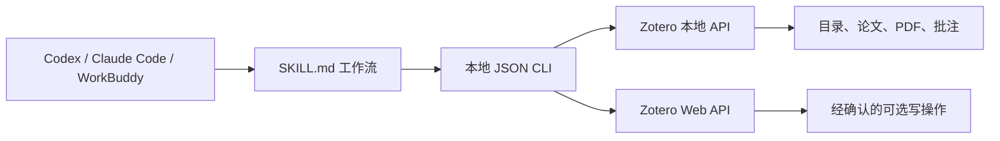

<div align="center">

# Zotero Research Assistant Skill

**让 Codex、Claude Code、WorkBuddy 等智能体在本地访问 Zotero，且无需 MCP。**

简体中文 · [English](README.md)


</div>

## 项目简介

Zotero Research Assistant 是一个可移植的 **Agent Skill**，可以让 Codex、Claude Code、WorkBuddy 以及其他具备终端执行能力的智能体搜索和分析真实的 Zotero 文献库。

项目不启动 MCP Server，而是提供本地 Python JSON CLI。智能体读取 `SKILL.md`，执行确定性的本地命令，并根据 Zotero 返回的真实数据回答，避免凭空猜测用户的文献库内容。

## 由智能体驱动的 Zotero Skill

本仓库不包含或启动任何大语言模型、模型 SDK、独立聊天程序或本地模型运行时。所有推理均由 Codex、Claude Code、WorkBuddy 或其他兼容 Agent 完成，Agent 会自动调用本项目提供的 Zotero 工具。本文中的“本地模式”仅指 **Zotero 本地 API**，不表示本地 AI 模型。



## 主要功能

- 根据 key、精确名称或 `父目录/子目录` 路径解析 Zotero 目录
- 递归读取子目录，并自动去重
- 同名目录或目录不存在时明确报错，不擅自猜测
- 支持全库搜索和目录范围内搜索
- 读取元数据、附件、笔记、PDF 正文和 Zotero 原生批注
- 分段连续读取 PDF，不再将前几千字符当作全文
- 将独立 PDF 作为文档返回，同时过滤论文下面重复的 PDF 附件
- 支持本地、云端和混合连接模式
- 笔记及标签写入具有程序级确认保护
- 输出机器可读 JSON，可接入不同厂商的智能体
- 不需要 MCP、浏览器插件或后台服务

## 为什么目录检索不会再跑偏

当用户提出：

> 列出“人机交互”目录下的论文。

Skill 不会把“人机交互”当成全库关键词，而是：

1. 将名称解析成唯一的 Zotero collection key；
2. 直接读取该 collection 的条目；
3. 根据需要包含全部子目录；
4. 返回每个条目实际匹配的目录路径。

如果目录不存在或存在多个同名目录，命令会失败并要求明确范围，不会返回不相关论文。

## 环境要求

- Python 3.10+
- Zotero 7+，用于本地 API 和全文索引
- 具备终端执行能力的智能体
- 使用本地模式时保持 Zotero 桌面端运行

在 Zotero 中开启：

`设置 → 高级 → 允许此计算机上的其他程序与 Zotero 通讯`

## 快速开始

### 1. 获取项目

方式一：使用 Git 克隆：

```bash
git clone https://github.com/Bubble-OoO/zotero-research-assistant-skill.git
```

方式二：打开 [GitHub 仓库](https://github.com/Bubble-OoO/zotero-research-assistant-skill)，选择 **Code → Download ZIP**，或者直接[下载 ZIP](https://github.com/Bubble-OoO/zotero-research-assistant-skill/archive/refs/heads/main.zip)，然后解压。下载后的目录名称通常是 `zotero-research-assistant-skill-main`。

### 2. 让 Codex 自动完成配置

在 Codex 中打开刚才克隆或解压的项目目录，新建一个普通任务并粘贴以下内容。此时 Skill 还没有安装，所以不要先使用 `$zotero-research-assistant`：

```text
请自动配置当前目录中的 Zotero Research Assistant Skill。请先阅读 SKILL.md、README.zh-CN.md 和 references/setup.md，然后：
1. 检测可用的 Python 3.10+ 或 Conda 环境，选择合适的解释器并安装 requirements.txt。
2. 如果 .env 不存在，从 .env.example 创建；写入所选解释器的绝对路径作为 ZOTERO_PYTHON，并保持 ZOTERO_LOCAL=true。不要覆盖已有 .env 或凭据。
3. 将当前仓库链接到用户级 ~/.agents/skills/zotero-research-assistant；不要复制出第二份源码。
4. 运行 scripts/run_zotero.py health 验证环境，并清楚报告检查结果和仍需我完成的操作。
5. 不要安装或配置 MCP，不要配置本地模型；本地只读模式不需要索取 Zotero API key。
6. 不要让我手动运行命令或编辑配置文件；直接执行安全且可逆的配置操作，只在需要权限、凭据或 Zotero 界面操作时请求我确认。
```

Codex 会根据操作系统和现有环境选择 Python 或 Conda。安装依赖和写入用户级 Skill 目录时，Codex 可能弹出终端或文件权限确认；请检查目标路径后批准。自动配置失败时，再查看 [references/setup.md](references/setup.md) 中的手动安装和故障排查。

### 3. 直接开始使用

配置成功后，新建一个 Codex 任务并直接调用：

```text
$zotero-research-assistant 列出“人机交互”目录及其子目录中的论文
```

Agent 会自动读取 `SKILL.md`、检查 Zotero 连接、精确解析目录并运行所需脚本。若没有识别到 Skill，让 Agent 检查 `.agents/skills` 联接并修复；用户无需自行排查路径。

## 日常使用：只需告诉 Agent 目标

无需记忆命令或参数，可以直接提出研究任务，例如：

```text
$zotero-research-assistant 查找“人机交互”目录中的论文，并报告实际匹配的目录路径和论文总数
```

```text
$zotero-research-assistant 阅读指定论文的 PDF 全文和批注，然后总结研究问题、方法与结论
```

```text
$zotero-research-assistant 比较“人机交互”目录中这些论文的方法、数据集和局限性
```

Agent 会自行选择目录查询、元数据、PDF 正文、批注或笔记工具，并根据真实 Zotero 返回值回答，不需要用户运行 Python。

## 连接配置也交给 Agent

默认使用 Zotero 桌面端本地只读模式，不需要 Zotero API key。如需检查或切换模式，直接提出：

```text
$zotero-research-assistant 检查当前 Zotero 连接配置并自动修复可以安全修复的问题。不要输出任何凭据
```

```text
$zotero-research-assistant 将当前配置切换为 Zotero 本地只读模式，保留现有凭据，完成后运行健康检查
```

```text
$zotero-research-assistant 帮我配置 Zotero 云端或混合模式。先检查现有配置，只在确实缺少时说明需要哪些值，安全更新 .env 并验证连接，不要在回答中显示 API key
```

Agent 会负责检查并更新 `.env`。不要把 API key 粘贴到对话或提交到 Git；需要新凭据时，Agent 应让用户通过安全的本地方式填写。完整参数和跨 Agent 发现位置见 [references/setup.md](references/setup.md)。

## 独立 PDF 由 Agent 自动处理

Zotero 可以将 PDF 存放在正式文献条目下面，也可以把 PDF 作为没有父条目的独立附件。

- 论文下面的子 PDF 会被过滤，避免一篇论文重复计算两次。
- 没有父条目的独立 PDF 会被保留，并标记为 `"standaloneAttachment": true`。
- 如果独立 PDF 缺少作者、年份或 DOI，Agent 会明确指出缺失信息，并提示用户在 Zotero 中使用“检索 PDF 元数据”，不会编造元数据。

## 写操作由 Agent 执行并要求确认

可以直接要求 Agent 添加笔记或标签：

```text
$zotero-research-assistant 根据这篇论文的 PDF 内容起草一条 Zotero 笔记，并准备写入
```

Agent 会先展示完整写入内容。用户在下一条消息中明确确认后，Agent 才会自动执行写入；未确认时 CLI 会拒绝操作。写入需要具备写权限的 Zotero API key，但用户不需要自行运行写入命令。

## 测试与故障排查也交给 Agent

在项目目录中直接告诉 Codex：

```text
请自动检查这个 Zotero Skill：验证 Skill 结构，运行全部测试和健康检查，修复属于项目本身的问题，并报告结果。不要让我手动运行命令；不要修改或显示已有凭据
```

如果 Skill 尚未被识别，也可以在源码目录中使用这段普通提示。Agent 会检查解释器、依赖、`.env`、Skill 联接和 Zotero 连接。只有启动 Zotero、开启 Zotero 本地通讯、提供新凭据、批准受保护的文件操作和确认外部写入必须由用户完成。

## 项目结构

```text
zotero-research-assistant-skill/
├── SKILL.md                 # 智能体工作流和安全规则
├── README.md                # 英文说明
├── README.zh-CN.md          # 简体中文说明
├── .env.example             # 安全配置模板
├── requirements.txt
├── agents/
│   └── openai.yaml          # Codex Skill 元数据
├── references/
│   └── setup.md             # 详细配置与故障排查
├── scripts/
│   ├── zotero_cli.py        # 与智能体无关的 JSON CLI
│   ├── run_zotero.py        # 自动选择 Python/Conda 解释器
│   └── zotero_tools.py      # Zotero 读写实现
└── tests/
```

## 设计参考

项目参考了以下开源项目的能力设计：

- [maciechen/zotero-mcp-workbuddy-guide](https://github.com/maciechen/zotero-mcp-workbuddy-guide)
- [54yyyu/zotero-mcp](https://github.com/54yyyu/zotero-mcp)
- [Pyzotero](https://github.com/urschrei/pyzotero)

本项目没有使用 MCP，而是通过本地 Skill 和 JSON CLI 提供相应的核心科研能力。

