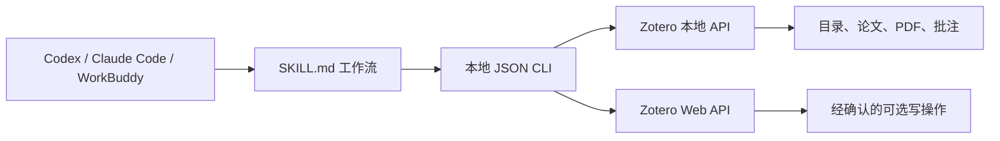

<div align="center">

# Zotero Research Assistant Skill

**让 Codex、Claude Code、WorkBuddy 等智能体在本地访问 Zotero，且无需 MCP。**

简体中文 · [English](README.md)


</div>

## 项目简介

Zotero Research Assistant 是一个可移植的 **Agent Skill**，可以让 Codex、Claude Code、WorkBuddy 以及其他具备终端执行能力的智能体搜索和分析真实的 Zotero 文献库。

项目不启动 MCP Server，而是提供本地 Python JSON CLI。智能体读取 `SKILL.md`，执行确定性的本地命令，并根据 Zotero 返回的真实数据回答，避免凭空猜测用户的文献库内容。



## 主要功能

- 根据 key、精确名称或 `父目录/子目录` 路径解析 Zotero 目录
- 递归读取子目录，并自动去重
- 同名目录或目录不存在时明确报错，不擅自猜测
- 支持全库搜索和目录范围内搜索
- 读取元数据、附件、笔记、PDF 正文和 Zotero 原生批注
- 分段连续读取 PDF，不再将前几千字符当作全文
- 将独立 PDF 作为文档返回，同时过滤论文下面重复的 PDF 附件
- 支持本地、云端和混合连接模式
- 笔记及标签写入具有程序级确认保护
- 输出机器可读 JSON，可接入不同厂商的智能体
- 不需要 MCP、浏览器插件或后台服务

## 为什么目录检索不会再跑偏

当用户提出：

> 列出“人机交互”目录下的论文。

Skill 不会把“人机交互”当成全库关键词，而是：

1. 将名称解析成唯一的 Zotero collection key；
2. 直接读取该 collection 的条目；
3. 根据需要包含全部子目录；
4. 返回每个条目实际匹配的目录路径。

如果目录不存在或存在多个同名目录，命令会失败并要求明确范围，不会返回不相关论文。

## 环境要求

- Python 3.10+
- Zotero 7+，用于本地 API 和全文索引
- 具备终端执行能力的智能体
- 使用本地模式时保持 Zotero 桌面端运行

在 Zotero 中开启：

`设置 → 高级 → 允许此计算机上的其他程序与 Zotero 通讯`

## 快速开始

```bash
git clone <你的仓库地址>
cd zotero-research-assistant
python -m pip install -r requirements.txt
```

创建本地配置：

### Windows 命令提示符

```cmd
copy .env.example .env
python scripts\zotero_cli.py health
```

### macOS / Linux

```bash
cp .env.example .env
python scripts/zotero_cli.py health
```

连接成功时会返回：

```json
{
  "ok": true,
  "mode": "local",
  "writeConfigured": false
}
```

## 连接模式

| 模式 | 读取 | 写入 | 所需配置 |
| --- | --- | --- | --- |
| 本地模式 | Zotero 桌面端本地 API | 禁用 | `ZOTERO_LOCAL=true` |
| 混合模式 | 本地 API | Zotero Web API | 本地模式配置，加 library ID 和 API key |
| 云端模式 | Zotero Web API | Zotero Web API | `ZOTERO_LOCAL=false`、library ID、API key |

最小本地 `.env`：

```dotenv
ZOTERO_LOCAL=true
ZOTERO_DATA_DIR=~/Zotero
```

如需混合模式或云端写入，再配置：

```dotenv
ZOTERO_LIBRARY_ID=
ZOTERO_LIBRARY_TYPE=user
ZOTERO_API_KEY=
```

不要提交 `.env`，也不要把 API key 粘贴到智能体对话中。

## 安装到智能体

在项目根目录执行：

```bash
python scripts/install_skill.py codex
python scripts/install_skill.py claude
python scripts/install_skill.py workbuddy
```

安装脚本不会复制 `.env`，以免后续更新覆盖本地凭据。请单独把 `.env` 复制到安装后的 Skill 目录。

| 智能体 | 个人 Skill 目录 | 调用示例 |
| --- | --- | --- |
| Codex | `~/.codex/skills/zotero-research-assistant/` | `$zotero-research-assistant 列出“人机交互”目录下的论文` |
| Claude Code | `~/.claude/skills/zotero-research-assistant/` | `/zotero-research-assistant 列出“人机交互”目录下的论文` |
| WorkBuddy | 在 Skills 页面导入文件夹或 ZIP；支持文件发现的版本也可使用 `~/.workbuddy/skills/` | 自然语言提问并选择该 Skill |

如果新建的顶层 Skill 目录没有立即被识别，请重启智能体或新建任务。

## CLI 使用示例

```bash
# 检查连接
python scripts/zotero_cli.py health

# 精确查找目录并查看完整路径
python scripts/zotero_cli.py find-collection "人机交互"

# 读取目录及全部子目录中的文档
python scripts/zotero_cli.py collection-items "人机交互" --recursive --limit 200

# 搜索整个文献库
python scripts/zotero_cli.py search "人机协同写作" --limit 50

# 只在一个目录内搜索
python scripts/zotero_cli.py search "evaluation" --collection "人机交互" --recursive

# 读取元数据、批注或一段 PDF 正文
python scripts/zotero_cli.py item ITEMKEY
python scripts/zotero_cli.py annotations ITEMKEY
python scripts/zotero_cli.py read ITEMKEY --start 0 --max-chars 12000
```

所有命令都向标准输出写入 JSON；当 `ok` 为 `false` 时返回非零退出码。

## 独立 PDF 的处理

Zotero 可以将 PDF 存放在正式文献条目下面，也可以把 PDF 作为没有父条目的独立附件。

- 论文下面的子 PDF 会被过滤，避免一篇论文重复计算两次。
- 没有父条目的独立 PDF 会被保留，并标记为 `"standaloneAttachment": true`。
- 如果需要作者、年份、DOI 等完整信息，请在 Zotero 中右键独立 PDF，选择“检索 PDF 元数据”。

## 写操作保护

添加笔记或标签必须经过三步：

1. 智能体展示即将写入的完整内容或标签；
2. 用户在后续消息中明确确认；
3. 智能体使用 `--confirm-write` 重新执行命令。

如果没有该参数，CLI 会在打开写客户端之前拒绝操作。

```bash
python scripts/zotero_cli.py add-tags ITEMKEY 已读 重要 --confirm-write
```

即使读取采用本地模式，写入仍需要具备写权限的 Zotero API key。

## 测试

```bash
python -B -m unittest discover -s tests -v
```

测试覆盖精确及歧义目录解析、递归读取、去重、目录范围搜索、独立 PDF、CLI JSON 输出和写入确认。

## 项目结构

```text
zotero-research-assistant/
├── SKILL.md                 # 智能体工作流和安全规则
├── README.md                # 英文说明
├── README.zh-CN.md          # 简体中文说明
├── .env.example             # 安全配置模板
├── requirements.txt
├── agents/
│   └── openai.yaml          # Codex Skill 元数据
├── references/
│   └── setup.md             # 详细配置与故障排查
├── scripts/
│   ├── zotero_cli.py        # 与智能体无关的 JSON CLI
│   ├── zotero_tools.py      # Zotero 读写实现
│   ├── install_skill.py     # 本地 Skill 安装器
│   └── deepseek_agent.py    # 可选的独立对话 Agent
└── tests/
```

## 设计参考

项目参考了以下开源项目的能力设计：

- [maciechen/zotero-mcp-workbuddy-guide](https://github.com/maciechen/zotero-mcp-workbuddy-guide)
- [54yyyu/zotero-mcp](https://github.com/54yyyu/zotero-mcp)
- [Pyzotero](https://github.com/urschrei/pyzotero)

本项目没有使用 MCP，而是通过本地 Skill 和 JSON CLI 提供相应的核心科研能力。

